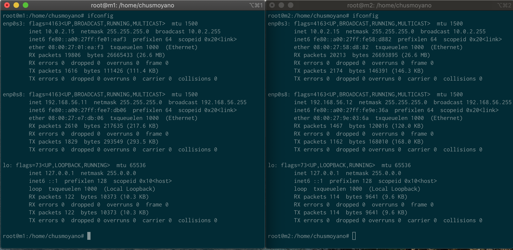
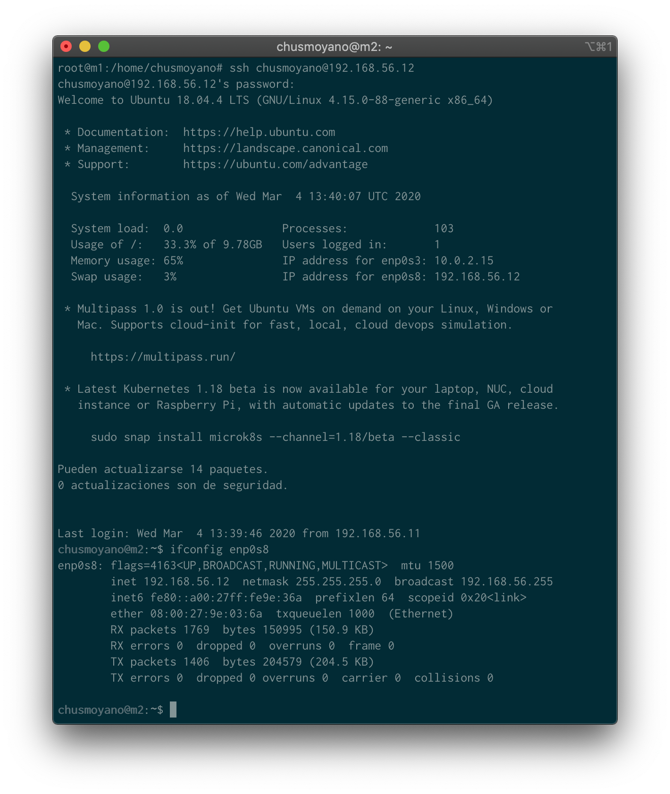
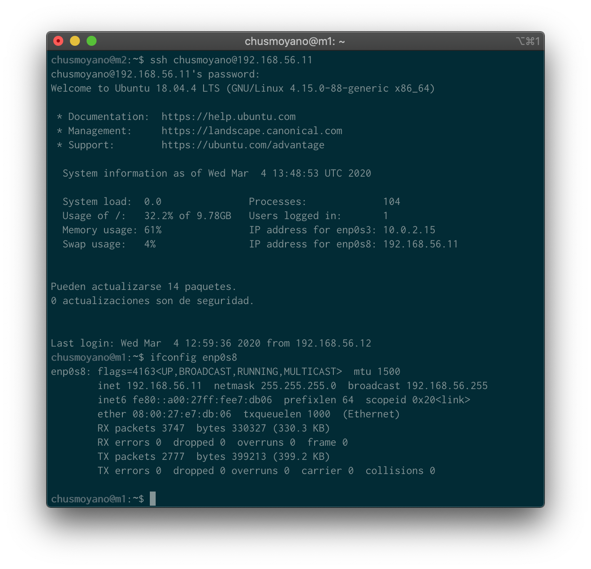
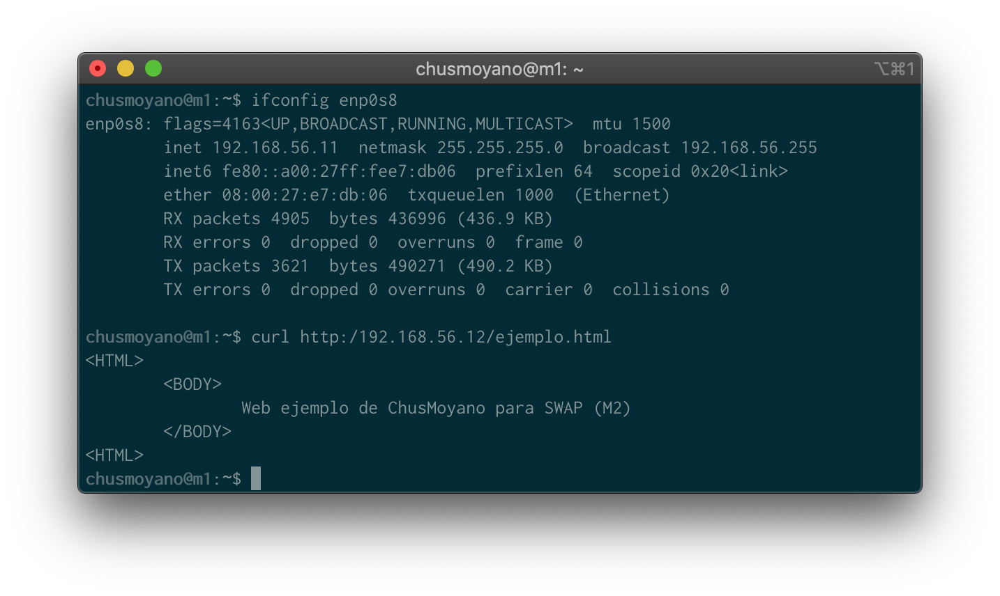
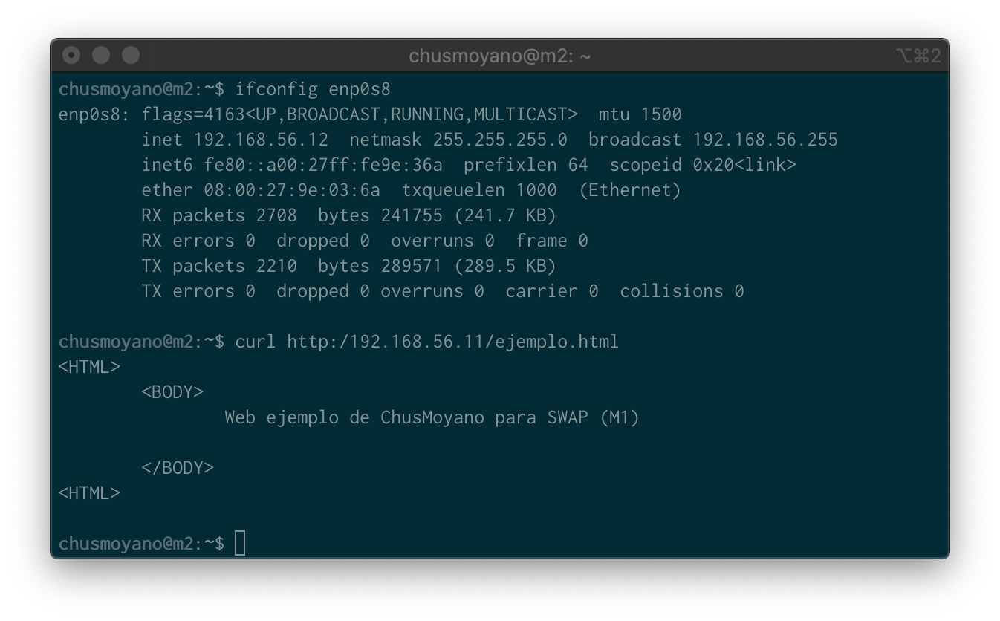

# Practica 1 SWAP: Preparación de las herramientas

## Descripción

En esta práctica el objetivo es configurar las máquinas virtuales (al menos dos) para trabajar en prácticas posteriores, asegurando la conectividad entre dichas máquinas.
Como resultado de la práctica 1 se mostrarán dos máquinas funcionando al profesor en clase (accesos con curl para solicitar páginas web sencillas, así como el acceso por SSH entre ambas máquinas).
Específicamente, hay que llevar a cabo las siguientes tareas:

1. acceder por ssh de una máquina a otra
2. acceder mediante la herramienta curl desde una máquina a la otra

El resultado de ejecutar estas tareas se debe documentar usando un archivo de texto y/o capturas de pantalla que se subirán a la cuenta de GitHub.

### 1º Acceder por SSH de una máquina a otra

En esta primera foto tenemos la configuración de ip que se han usado para estas máquinas, ambas en el adaptador **enp0s8**.

* La máquina 1 (m1) tiene asignada la IP: **192.168.56.11**

* La máquina 2 (m2) tiene asignada la IP: **192.168.56.12**

#### 1.1 Conexión SSH M1 a M2

En este apartado mostramos la conexión desde la máquina 1 (m1) a la máquina 2 (m2).

Como vemos al principio estamos en la máquina m1 en el usuario root:
`root@m1: /home/chusmoyano`.

Hacemos el ssh usando el comando `ssh chusmoyano@192.168.56.12` y para comprobar que estamos en m2, comprobamos la IP actual con ayuda del comando `ifconfig enp0s8`.

#### 1.2 Conexión SSH M2 a M1

En este apartado mostramos la conexión desde la máquina 2 (m2) a la máquina 1 (m1).

Como vemos al principio estamos en la máquina m2 en el usuario chusmoyano:
`chusmoyano@m2:`.

Hacemos el ssh usando el comando `ssh chusmoyano@192.168.56.11` y para comprobar que estamos en m1, comprobamos la IP de la máquina actual con ayuda del comando `ifconfig enp0s8`.

### 2º Acceder mediante la herramienta curl desde una máquina a la otra
Para hacer los curl se ha usado el comando `curl http:/<direccion ip>\ejemplo.html`. Cada html muestra un mensaje de ejemplo con el nombre al final de la maquina en la que está alojado.

#### 2.1 Curl HTML desde M1 a M2

#### 2.2 Curl HTML desde M2 a M1
